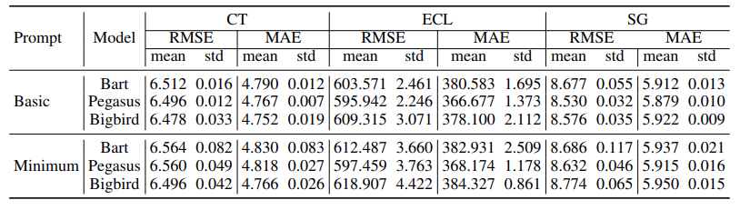

- PISA-Prompt: this is the default PISA prompts. If you'd like to use our dataset, please use this directly.
- BasicPrompt: this is the Basic Prompt used in Prompts Ablation Study in our paper (see the Supp. doc).
- MinimumPrompt: this is the Minimum Prompt used in Prompts Ablation Study in our paper (see the Supp. doc).

> The prompts ablation study results (Table 10 in the paper)

  
:smiley:Please note that only validation sets of three sub-sets (CT, ECL, SG) are provided as PISA examples during the submission period.

:relaxed:After the acceptance decision notification, the full PISA dataset (including train/val/testing sets) will be uploaded here and publicly available.

:hand: We strongly recommend users to register [SafeGraph Data for Academics](https://www.safegraph.com/academics) to know more about SafeGraph Data.
